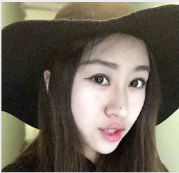

# Data Scientist | Data Engineer | Machine Learning Engineer 
 

- 🔭 I’m currently working on AI Chatbot Project  check it out:  https://github.com/melanieshi0120/AI_Chatbot_Project
- 🌱 I’m currently learning  AWS and GCP 

## Introduction
Experience in data acquisition and data modeling, statistical analysis, machine learning,
deep learning, and NLP. With a background in Economics and Data Science, I bring strong skills in Python coding,
Machine Learning, and statistical skills as well as a passion for delivering valuable data through analytical 
functions and data retrieval methods. 
## Languages
Fluent in English, Chinese, and Korean.
## Information
- Email: melaniesoek0120@gmail.com
- Blog: https://medium.com/@melaniesoek0120
- Linkedin: http://www.linkedin.com/in/melanieseok-huashi
## Technical Skills
Python, OOP, SQL, Pandas, NumPy, Statsmodels, Matplotlib, Seaborn, Tensorflow, Keras, PyTorch, SciPy, Tableau, Google Analytics, MySQL, R, Excel, Machine Learning, Deep Learning, Statistical Analysis, NLP, Web Scraping, API Call
## Projects
- Linear Regression  https://github.com/melanieshi0120/Agriculture_Project
- Text Classification & NLP https://github.com/melanieshi0120/NLP_Analysis_Amazon_Reviews
- Image Classification  https://github.com/melanieshi0120/COVID_19_chest_CT_Image_Classification
- Chatbot & NLP https://github.com/melanieshi0120/AI_Chatbot_Project
- Time Series Analysis https://github.com/melanieshi0120/DKHS
- PCA https://github.com/melanieshi0120/Principal_Component_Analysis-PCA-_Facial_Recognition
